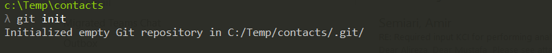
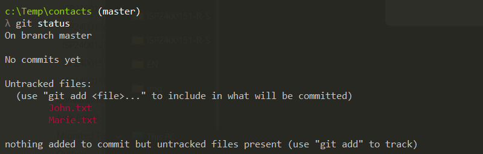
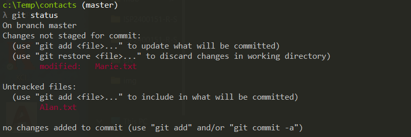

# Use Git via the Command-Line interface

This page will show how to perform the main git operations using the
git Command-Line Interface (CLI) and it will do so by walking the reader
through the creation of a text-based contact book, where every
contact item is a text file.

> - For a general description of what each Git command does, 
>   see [this article](./index.md) insted.
> - If you don't have the git CLI installed on your machine yet, you 
>   can download it from the [git website](https://git-scm.com/downloads).
> - This article will assume that you operate on Microsoft Windows, but the git
>   commands are exactly the same on other platforms.


## git init operation
> For a general description of this git operation see the [main article](index.md).

To initialize a new git repository with the git CLI, from the command-line
shell, first create a new project directory; we will call our project `contacts`. 


From within the `contacts` folder, run the `git init` command.


This command creates a `.git` sub-directory in the `contacts` directory.


## git commit operation
> For a general description of this git operation see the [main article](index.md).

In order to have some changes to commit, let's add the firt two items to our
contacts book by creating two files `John.txt` and `Marie.txt`.

Let's write the following content to `John.txt` and save it:
```
name: John Nash
phone: +1 617 253 1000
```

Let's write the following content to `Marie.txt` and save it:
```
name: Marie Kurie
phone: +33 1 56 24 55 00
```

You can visualize the current changes by using the `git status` command.



Git has correctly detected that, compared to the initial status (empty
directory) there are two new files. 

Say that this is a version of our project that we want to commit; first 
of all we need to tell git which changes we want to commit and which not: 
for example you may want to commit only `Marie.txt` or only `John.txt`. You
do that by adding the changes you want to commit to a virtual bucket
named *staging area*, using the `git add` command. In this case we will
add all the changes to the staging area.


If we run the `git status` command again, we see that the status has
changed: the two files are not in the *Untracked* status anymore, but
they are now under *Changes to be commited*.


Now we can finally commit the changes and we do it using the
`git commit` command, followed by a message that describes the
commit.


If you run the `git status` command again, git will tell you that
there have been made no changes since the last commit.


You can repeat this as many times as you want. To ilustrate that, let's 
apply some changes and commit them. 

First of all we mispelled the family name of Marie, therefore we need 
to change *'Kurie'*  to *'Curie'*. Let's do it and save the file.

```
name: Marie Curie
phone: +33 1 56 24 55 00
```

Then let's add the new item `Alan.txt` to our contacts book and set
its content as follows:

```
name: Alan Turing
phone: +44 20 3862 3352
```

After modifying `Marie.txt` and adding `Alan.txt` to our project, 
the status will be as follows:



Again git has detected the changes correctly: 1 file added and 1 file
changed! Let's just stage and commit these changes.


If you want to list all the commits stored so far, you can do so by
entering the `git log` command.


As you can see, git has automatically assigned a unique name to each of
the two commits:

- The first commit is called `9b457e6394b1a3918d030a703cf25b5cc81e31a4`
- The second commit is called `dd8653b267c8574d592def438ce2f8195fc625ad`


## git checkout operation
> For a description of this operation see the [main tutorial](index.md).

So far we have initialized a git project and commited two sets of 
changes. Our project folder is now identical to the second commit. If
you want to go back to the first commit, you can use the `git checkout`
command. In the following example, the first commit (the one named
`9b457e6394b1a3918d030a703cf25b5cc81e31a4`) is checked out; notice that
you need to pass only the fist few characters of the commit name: just
enough to uniquely identify the commit.


You can now verify that, after this command, the content of the folder
has been modified to match the content at the moment of the first commit,
which is:

- Only two files present: `Marie.txt` and `John.txt`
- The file `Marie.txt` contains the mispelled name *'Kourie'*

Although possible, this way of switching between commits is not commonly
used; branching is a much better way of doing that. Let's therefore restore 
the original sistuation by checkking out the master branch.


Again, you can now verify that the lates working directory content has 
been restored. In particular:

- The folder contains three files: `Marie.txt`, `John.txt` and `Alan.txt`
- The file `Marie.txt` contains the correctly spelled name *'Courie'*


## git branch operations
> For a description of this operation see the [main tutorial](index.md).

Say that you decide to convert your items format from plain text to
[JSON](https://en.wikipedia.org/wiki/JSON) but while you are busy with
it you want to keep your current format available. You then need to
branch your project, using the `git branch` command. We will call the
new branch "json".


Now the new `json` branch has been created; you can see the list of
extisting branches by typing the `git branch` command without parameters.


The previous command shows that there are two branches and that the
active branch (the one with a * next to it) is `master`. The branch
command, indeed, creates a new branch but it doesn't automatically
activate it. To switch to the `json` branch, we use the `git checkout`
command:


> Notice that the screenshot of this tutorial are not made using
> the default windows shell (cmd), but using a git-aware shell. 
> That's why you see, for example, the name of the current branch
> next to the prompt.

Now the active branch is `json`, but since we have just created it,
its content is identical to the `master` branch. Let's then start
committing changes, knowing that the original `master` branch 
content is just a `git checkout master` away.

Let's rename `Marie.txt` to `Marie.json` and modify its content
as follows ...

```
{
    "name"  : "Marie Curie", 
    "phone" : "+33 1 56 24 55 00"
}
```

... and let's then save and commit the change.


Let's now rename `John.txt` to `John.json` and modify its content
as follows ...

```
{
    "name"  : "John Nash", 
    "phone" : "+1 617 253 1000"
}
```

... and let's then save and commit the change.


Let's finally rename `Alan.txt` to `Alan.json` and modify its content
as follows ...

```
{
    "name"  : "Alan Turing", 
    "phone" : "+44 20 3862 3352"
}
```

... and let's then save and commit the change.


We have now performed 5 commits in total: the first two in `master` and
three in `json`, as shown by the `git log` command.


We could now restore the `master` branch using the command `git checkout master`.


Of course we can also go back to the `json` branch using the `git checkout json`,
but first let's modify the master branch: let's create the following `Enrico.txt`
file and save it.

```
name: Enrico Fermi
phone: +39 06 4550 2901
```

Let's then commit the changes; notice that the changes will be always committed 
to the current (master, in this case) branch.


Let's now log the commits (with some extra options to show the branch tree
structure).


As you can see, the latest commit (add Enrico) belongs to the master branch.
You can verify that by switching back to the json branch and checking that
`Enrico.txt` is not present in that branch.


## git merge operation
> For a description of this operation see the [main tutorial](index.md).

In the previous chapters we have created a git-versioned project and committed
some changes in different branches. Now we have two divergent branches and
in this chapter we will merge them together in the master branch again.

To merge the `json` branch into the `master` branch, we need to switch to
`master` and enter the git command `git merge json`.


You can verify that in the working directory there are now all the changes
performed in the `json` branch and all the changes performed in the `master`
branch. By logging the commits tree, you can also see that the merge command
has automatically created a new commit.


> Once you are done with the `json` branch, you may delete it using the
> command `git branch -d json`


