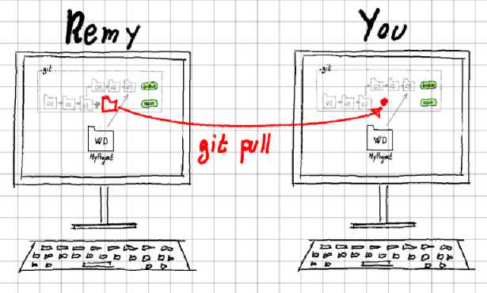

# Git Tutorial for non-programmers

Git is a free and open source distributed version control system designed to 
handle everything from small to very large projects with speed and efficiency. 
It is the most popular version control system among professional programmers, 
and this tutorial aims to making it understandable and usable by non-programmers.

Git can be used both from the command-line interface (a.k.a. `cmd` under windows) or
via a graphical user interface. This page describes the operations that Git can
execute, independently from the type of interface and refers to other pages for 
the CLI way of doing it. This resource does not explain how to use any of the
[several available GUI's](https://git-scm.com/downloads/guis), but you can find 
the documentation you need on the internet once you know the basics. 

## Let's get started: `init`

Say that you have a folder `MyProject` containing some files (or empty) and you want to start 
version-controlling it with git. To do that you ask git to run the `init` operation.

The `git init` operation creates a `.git` subfolder inside the `MyProject` folder, which will
hold all the git internal files. You don't need to be concerned about that folder; just don't
delet it, or git will lost all its memory about the version history of `MyProject`.

> Learn how to perform the `git init` operation via the [CLI](cli.md#git-init-operation).

## Save your work: `commit`

We all make backups of our work so now and then: we take the folder containig our work
and we make a copy of it, namining it something like `MyProject_2024-10-14`. So, if anything
goes wrong with the files in our working directory `MyProject`, we can always restore
an older version of it.

In git terms, this is a *commit* operation (to commit = consign or record for preservation).
You run a `git commit` operation and git will make a copy of your working directory and
give it a name for you. You can commit as many versions of your working directory as you want.

> Notice that git commit takes a snapshot of your entire working directory, but it does
> it in a smart and disk-space-efficient way: just the minimum amount of information
> strictly necessary will be stored on disk.

We will visually represnt the working directory (WD) and its commits (git name for snapshot/backup) 
as shown in the following picture.

> Learn how to perform the `git commit` operation via the [CLI](cli.md#git-commit-operation).

## Restore your work: `checkout`

If you want to restore the working directory to the status it had at the moment of
a certain commit, you run the `git checkout` operation.

> Learn how to perform the `git checkout` operation via the [CLI](cli.md#git-commit-operation).

## Try new ideas: `branch`

There are situations when you may want to create a copy (WD2) of your working
directory (WD1), try something new without messing up the original copy WD1 and 
eventually, if your new idea works, delete the original WD1 and go back to having 
only one version (WD2) of your work. If your new idea turns out to be a bad idea, 
you can just delete the second copy WD2 of your working directory and go back to 
the original copy WD1.

The operation of creating a copy of your working directory, in Git is called
`branching`; except that Git doesn't really create a copy of anything: the branch
exists in the `.git` folder and you just choose which branch gets loaded in your
working directory.

Say that you have done 3 commits and that your working directory corresponds to
the third commit. In git terms, you are on the `main branch` and the status
of your project looks like the following figure.

When you create a new branch (say branch *'bravo'*), it's like if a copy of 
commit 03 is made internally by git.

Now you can switch to the branch *'bravo'* and start committing changes to that
branch, while the *'main'* branch stays unchanged.

You can switch between your two branches as many times as you want. Every time you
switch branch, the latest commit of that branch will be checked-out to your
working directory. If you switch back to the *'main'* branch, you can also keep
committing changes to it.

> Learn how to perform the `git branch` operation via the [CLI](cli.md#git-branch-operation).

## Synchronize branches: `merge`

In the previous section we talked about the `git banch` operation, which is
conceptually equivalent to making a copy (a branch) of your working directory
and having two versions of the same project. Let's imagine that we have 
modified both copies of the project forlder (committed changes in both branches). 
In such a situation, going back to one version that keeps all the changes made 
to both branches, can be a real pain. Git makes it easy, by implementing 
the `merge` command.

The `git merge` command takes the last commits of two different branches and mixes 
them together in a new commit, so that the new commit contains all the changes of both 
the branches. The following figure shows merging the branch *'bravo'* (commit 05) and 
the branch *'main'* (commit 07) into the new commit 08, which is then added to
the *'main'* branch.

> Learn how to perform the `git merge` operation via the [CLI](cli.md#git-merge-operation).

## Collaboration: `clone`, `push` and `pull`

Say that Remy, a colleagues of yours, has a Git-versioned project for which he needs 
your help and say that you do want to cooperate with him on his project.
One way for Remy to allow you to do so is by giving you access to his project folder 
and let you modify its content. A better way is to give you a copy of his project
folder, let you modify your own copy of the files and then merge the two copies again.

In the Git world, the operation of getting a copy of someone else's project folder
from his computer to yours is called *'cloning'*.

When you have committed some changes to your local clone of Remy's project folder, 
you may want to send those commits over to Remy's machine, so he stays in sync.
This operation is called `push`: you push your changes to Remy's project folder.

When Remy has committed some changes to his local project folder, you may want
to fetch those commits from his machine to keep your clone in sync.
This operation is called `pull`: you pull Remy's changes from his project folder.

In reality, pull will not just fetch the remote commits to the local repository,
but it will also merge them. There is actually a git operation that fetches 
remote commits without merging them, and it is called (gess what) `git fetch`.

Of course collaboration is not limited to a two-people team: you can collaborate
with as many people as you want. Each collaborator holds his/her own version
of the project on his/her local machine and anybody can push to or pull from 
anybody else.

Of course collaborating on large projects requires a minimum of coordination
between the team members and the definition of a set of collaboration rules. 
Git doesn't dictate any of those rules and leaves the team members completely 
free to choose their cooperation strategy. 

Over time, two main git branching strategies for collaboration have emerged:
[Git Flow](https://nvie.com/posts/a-successful-git-branching-model/) and 
[trunk-based development](ttps://trunkbaseddevelopment.com/).
You can learn about them via the provided links or one of the many resources
available on the internet.

## What is GitHub then?

In the previous chapter we have stated that Remy can share his project folder 
over the network and give permission to other people to clone his folder and
push or pull changes to and from it. But whe haven't shown how Remy can 
actually to do that! That's because it's not a very straightforward operation 
for beginners (to who this articol is addressed). 

Luckily [GitHub](https://github.com/) (and many 
[other similar services](https://www.gartner.com/reviews/market/devops-platforms/vendor/github/product/github/alternatives))
come to the rescue, by providing an easy way (web-based interface) to create 
(and host) remote repositories and share them with others.

Therefore GitHub and its competitors are just web-services based on Git.

## Learn more

There are a ton of free resources available on the internet for learning Git.
Here is a selection of them.

- [Pro Git Book](https://git-scm.com/book/en/v2) a complete (and free) book 
  about Git.
- [Learn Git branching](https://learngitbranching.js.org/) an interactive resource
  for learning Git.
- [Linus Torvalds & git](https://www.youtube.com/watch?v=idLyobOhtO4) a video of
  Linus Torvald (the creator of Linux and Git) talking about Git at Google. If
  you are a nerd like me, you'll find this also very entertaining.

